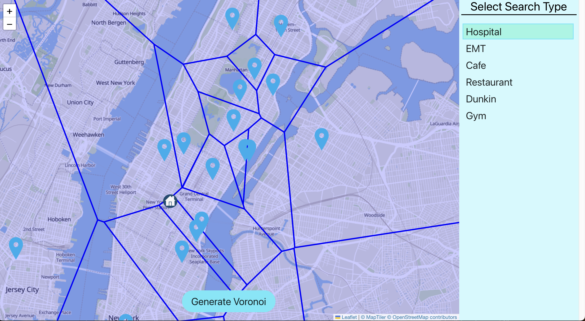
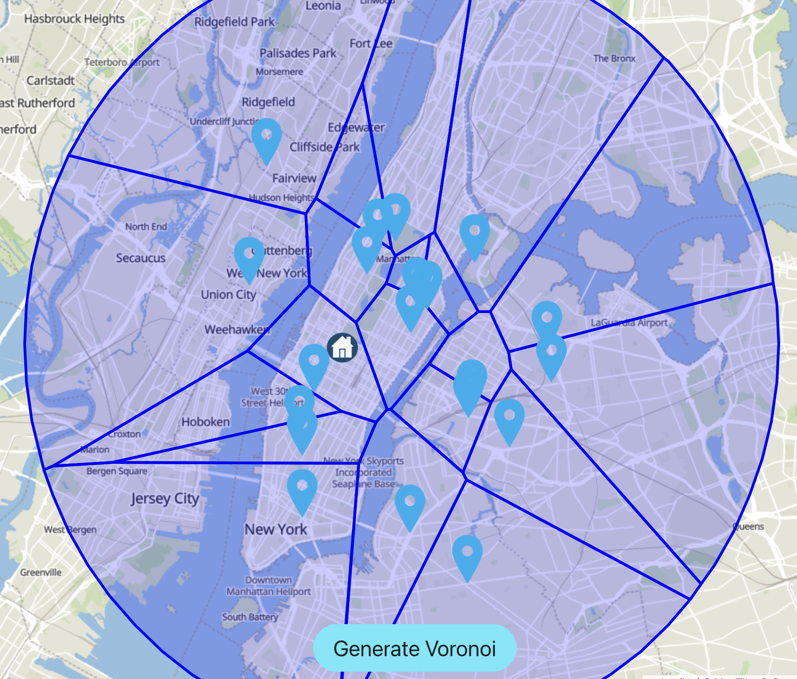
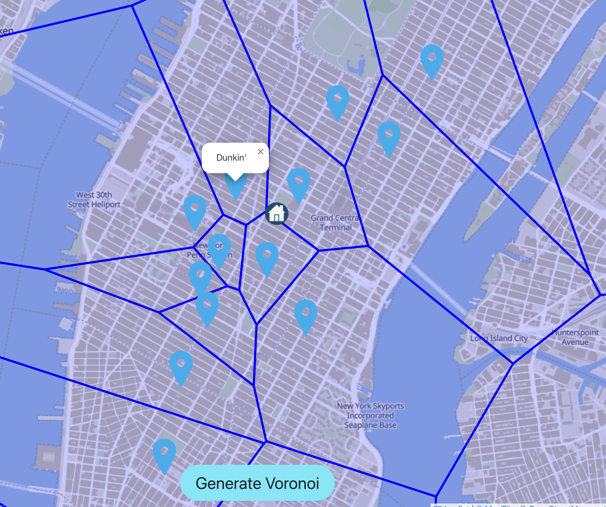

# GeospatialVoronoiVisualizer

## Problem
I recently decided that I wanted to work out and discovered that there were many places that offer gym memberships that vary in size and number of members. I wanted a way to discover more geographical information about the gyms aside from their distance from my house.

## Solution
The voronoi diagram is visualization tool allowing the user gain insights into the relative location of multiple datapoints and their relation to others. It enabled me to disover not only what are the closest gyms to me, but also how competitive the location is compared to gyms in similar areas. I also noticed that the Voronoi diagram can be useful for new homeowners to learn more about their surroundings as well as for retail investors looking into the relative competition in the area.  

Attached below is an example image of the applicaiton showing the relative distance of hospitals in the area

# More example images

## How to use algorithm/program
1. Frontend: After opening repo, run **npm install** and **npm start**
2. Backend: Install necessary packages and run server.py

## What I learned
1. Flask Integration to React application
2. React Leaflet
3. Numpy data structure/data science applicaiton/visualization
